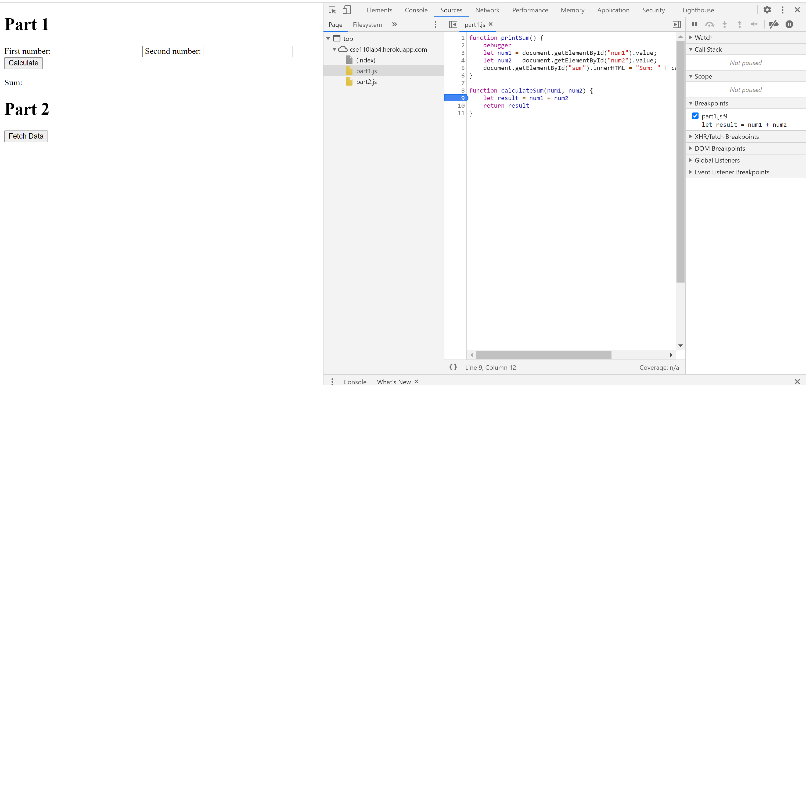
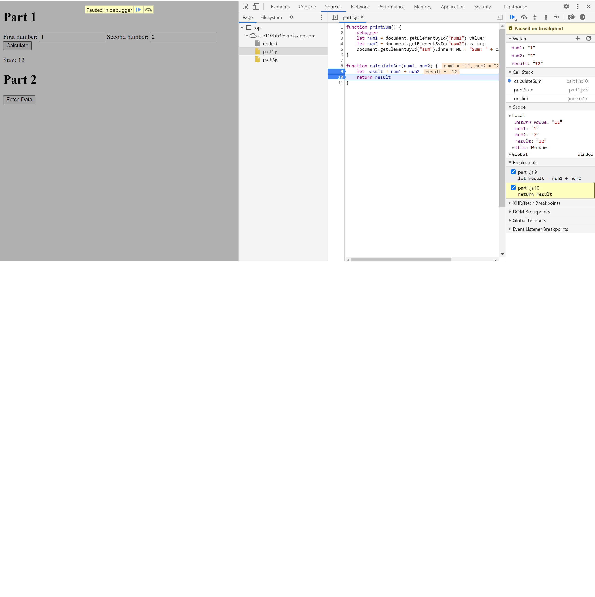

## Debugging
 
 
 - The bug was that the input are strings and thus result was a string
 - This is fixed by converting input to a number
 
## Network Tab
 1. citylots
 2. part2.js
 3. 11.7 Mb
 4. 150ms
 5. User-Agent: Mozilla/5.0 (Windows NT 10.0; Win64; x64) AppleWebKit/537.36 (KHTML, like Gecko) Chrome/88.0.4324.104 Safari/537.36
 6. Apache
 7. Tue, 26 Jan 2021 22:14:13 GMT
 8. application/json
 9. line 21: <button onClick={fetchData()}>Fetch Data</button>
